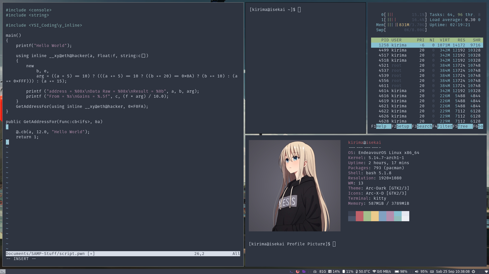
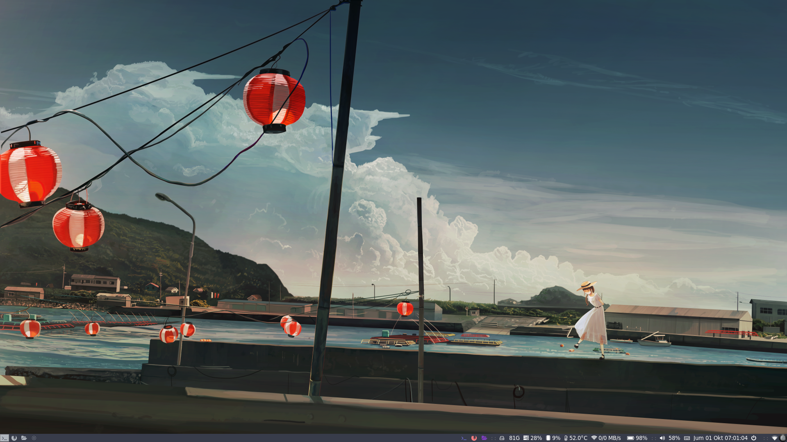

# dotfiles
My dotfiles based on endeavouros

This is my customized version so i don't have to deal with the settings ever again.

**NOTE:** 
I encourage you to check if you're using endeavourOS or not, because it's just a modification for basic dotfiles and not entirely full setup or anything.

## Installation
run bash file for make it easier, without ever manually adding things by yourself.

## Keybindings
I use Mod4 (Super/Windows Key) for controlling keybindings, you should look at [.config/i3/config](.config/i3/config) for more info.

## Footprint
I just update i3 keybinding, and add screenlayout then i change some default apps to Kitty, since xfce4-terminal is not good for me.

## Preview

